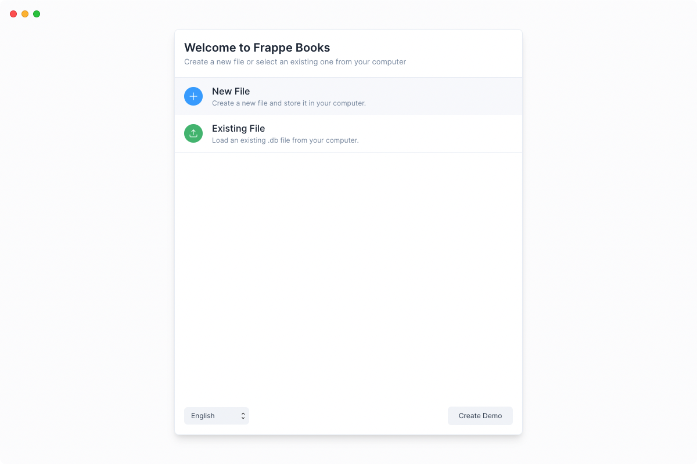
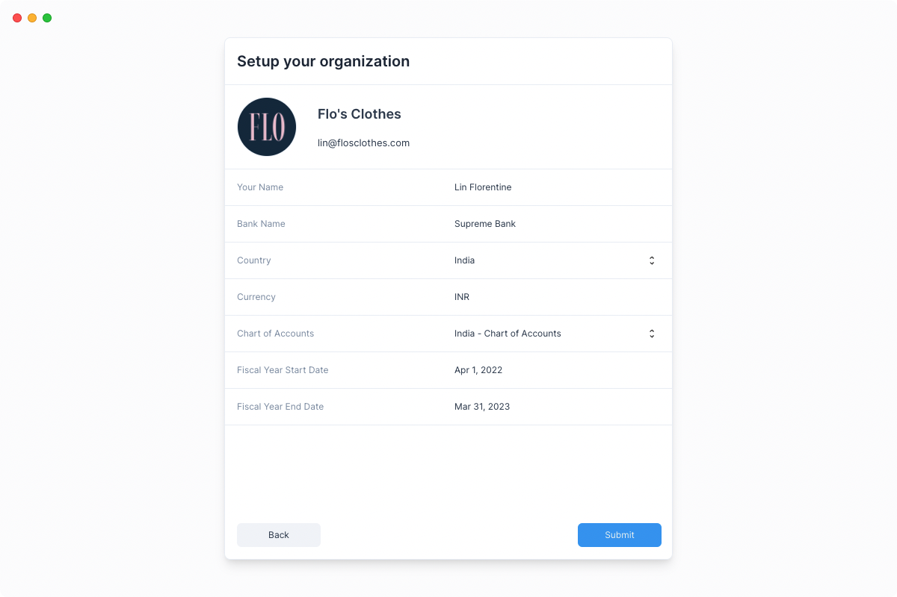
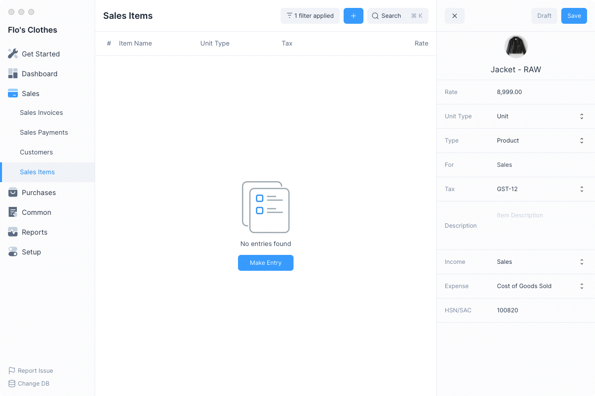
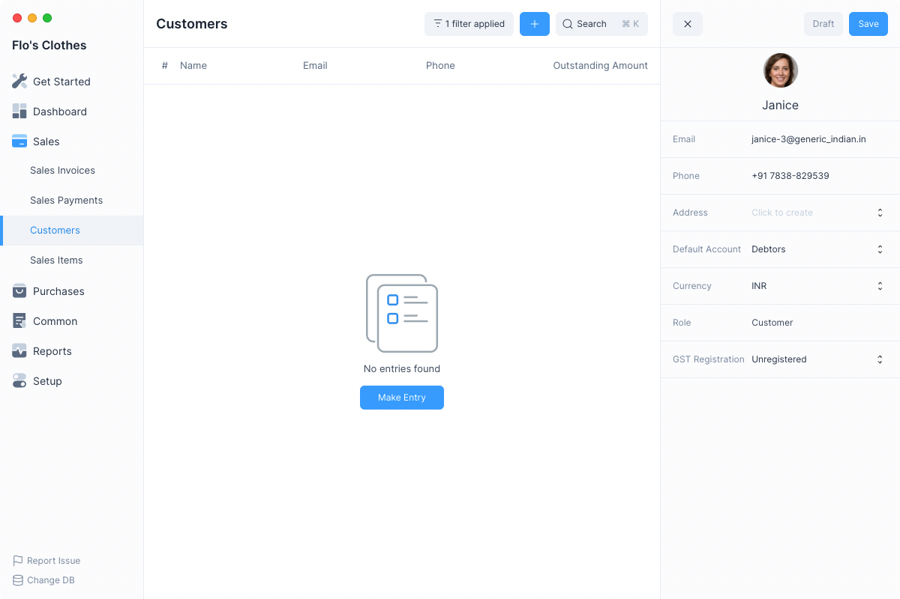
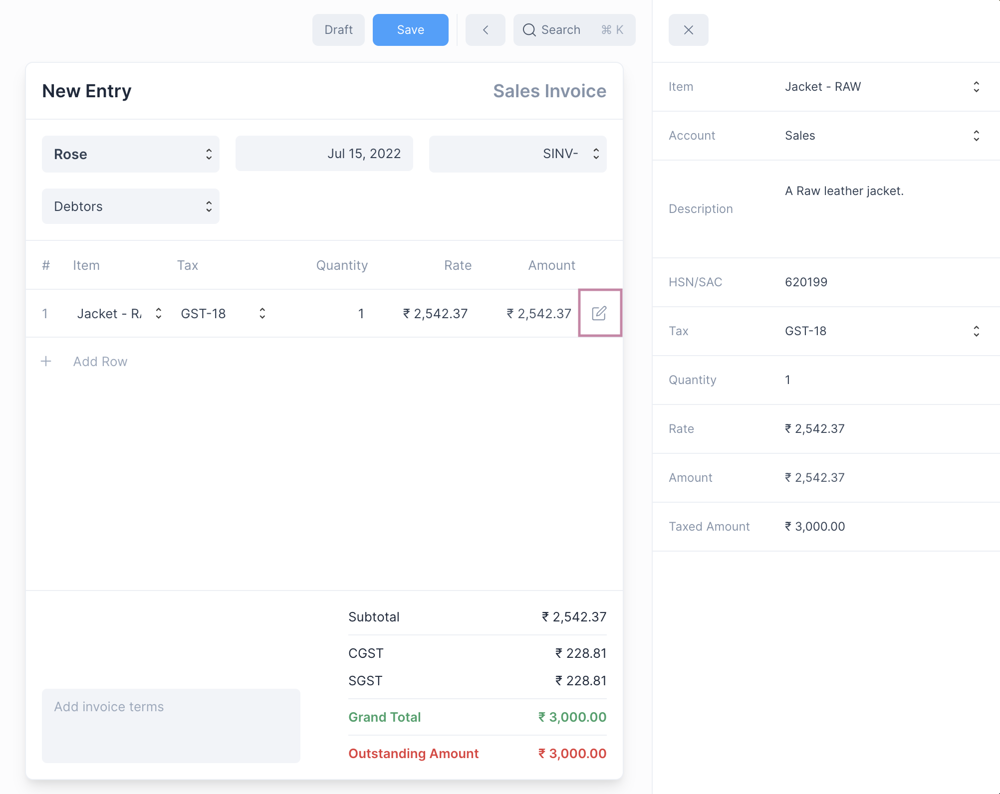
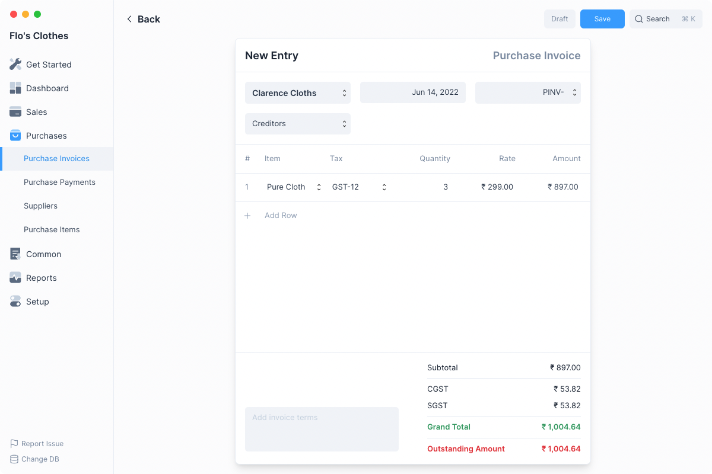

# Frappe Book
## Index

1. [Introduction](#introduction)
1. [Features](#features)
2. [Download](#download)
3. [Development](#development)
4. [Contributions and Community](#contributions-and-community)
5. [Links](#links)
6. [Translation Contributors](#translation-contributors)
7. [License](#license)
8. [QnA](#questions-and-answers)


## Introduction
Free Desktop book-keeping software for small businesses and freelancers.
## Features

1. Double-entry accounting
1. Invoicing
1. Billing
1. Payments
1. Journal Entries
1. Dashboard
1. Works Offline
1. Financial Reports
   - General Ledger
   - Profit and Loss Statement
   - Balance Sheet
   - Trial Balance


## Download
Download and install the latest release for your platform from the [releases page](https://github.com/frappe/books/releases) or the [download page](https://frappebooks.com/download).


## Development
Frappe Books is built on Vue.js and Electron. It is offline by default and uses a local SQLite file as the database.

### Pre-requisites
To get the dev environment up and running you need to first set up Node.js version 16.13.1 and npm. For this, we suggest using nvm.

##### Follow this step to install Node.js v16.13.1
Step 1:- install curl
```bash
sudo apt install curl
```

Step 2:- Install NVM tool
```bash
curl -o- https://raw.githubusercontent.com/nvm-sh/nvm/master/install.sh | bash
```

Step3:- Now check the installed version of nvm
```bash
nvm --version
```
Output:- 0.39.1

Step4:- Now with NVM installed, check the available Node.js versions.
```bash
nvm list-remote
```

Step5:- Install Node version
```bash
nvm install v16.13.1
```
You will successfully install Node v16.13.1

Next, you will need to install [yarn](https://classic.yarnpkg.com/lang/en/docs/install/#mac-stable).

### Clone and Run

Once you are through the Pre-requisites, you can run the following commands to setup Frappe Books for development and building:

```bash
# clone the repository
git clone https://github.com/frappe/books.git

# change directory
cd books

# install dependencies
yarn
```
#### Development

To run Frappe Books in development mode (with hot reload, etc):

```bash
# start the electron app
yarn electron:serve
```

## Getting Started with Frappe Books

### Setup Instance

When you open Frappe Books, you’ll be presented two options: **New File** and
**Existing File**. If this is the first time you are opening Frappe Books, click on
**New File**.

Now select an appropriate location where you want to store the file and give it
a name.



Frappe Books stores all your company data and transactions on a local `.db` file on your computer.

You can change the location of this `.db` file. If you have done so you can find it again by selecting the **Existing File** option.


Now, enter your Business Name, Business Email and Country Information. This will help set up the correct Chart of Accounts based on your country.



Congratulations! You now have a company set up on Frappe Books.

### Create Initial Entries
Let’s create some initial entries before you can start recording your transactions.

#### Add Sales Items

One of the most important things you will add in Books are your products or
services that you provide to your customers. Navigate to **Sales Items**

`Sales > Sales Items`



1. **Create a New Item Entry**: Click on the blue `+` button. Enter the Name and the Rate
2. **Select Type**: Select if your Item is a Product or Service.
3. **Set Default Tax**: Setting the default Tax for your Item will fetch it
   automatically when you create an Invoice.
4. **Click on Save**

You can set or change the other details for the item. Such as the Income or Expense accounts.

You can even set an image for the item.

#### Add Customers

Add your Customers to record their details and select them in Sales Invoices. First navigate to Customers

`Sales > Customers`



1. **Create a New Customer Entry**: Click on the blue `+` button. Enter the name of of the customer
2. **Click on Save**

You can enter additional details such as Email and Phone in the Customer entry.This will be shown when creating a Sales Invoice PDF.

### Sales Invoices
Sales Invoices are bills that are sent to your customers when an income is booked.

#### Creating Sales Invoices

First navigate to the Sales Invoices page
`Sales > Sales Invoices`

Then click on the blue `+` button to open the Sales Invoice form.


1. Select the Customer to whom you will be making a sale.
2. Click on Add Row and select the Item being sold. Default Tax will be fetched you can change it if required.
3. Enter the Quantity.
4. You can add more items or if you are done, click on Save.
5. Once finalized, click on Submit. Frappe Books will do the required ledger entries against the appropriate accounts.

This invoice is now in _“Submitted”_ state, it cannot be edited. The sales transaction has been recorded.

#### Editing an Invoice Item

To edit the values of an Invoice Item click on the edit button on the item row


From here you can change the item description, HSN code check the Taxed Amount,etc.


### Purchase Invoices

Purchase Invoices are bills that your supplier sends you when you make a purchase.

It is a transactional entry that denotes a purchase.

####Creating Purchase Invoices

First navigate to the Purchase Invoices page

`Purchases > Purchase Invoices`

Then click on the blue `+` button to open the Purchase Invoice form.



1. Select the Supplier from whom you will be making a purchase.
2. Click on Add Row and select the Item being purchased. Default Tax will be fetched you can change it if required.
3. Enter the Quantity.
4. You can add more items or if you are done, click on Save.
5. Once finalized, click on Submit. Frappe Books will do the required ledger entries against the appropriate accounts.

This invoice is now in _“Submitted”_ state, it cannot be edited. The purchase transaction has been recorded.

## Dashboard

Dashboard show an overview of Cash Flow, Profit and Loss, Pending Payments and
Expenses.

You can access the Dashboard from the sidebar.


### Period Selector

All sections of the Dashboard have a Period Selector. The default value is **This Year**. There are three options.

Consider today's date as 16 Jun, 2022. The three options will show analytics for the given range:

|   # | Option       | From         | Until (Today) |
| --: | :----------- | :----------- | :------------ |
|   1 | This Year    | 16 Jun, 2021 | 16 Jun, 2022  |
|   2 | This Quarter | 16 Mar, 2022 | 16 Jun, 2022  |
|   3 | This Month   | 16 May, 2022 | 16 Jun, 2022  |


The Cashflow and the Profit and Loss chart don't show the **This Month** option.

### Cashflow


The Cashflow chart shows the total amount of money being transferred into and out of your company over a period.


Get more information about frappe book view [frappe book Docuumentation](https://docs.frappebooks.com).

## Questions and Answers
**What is Vue.js?**
**Ans**:- Vue is a JavaScript framework for building user interfaces. It builds on top of standard HTML, CSS, and JavaScript and provides a declarative and component-based programming model that helps you efficiently develop user interfaces, be they simple or complex.

**What is Electron?**
**Ans**:- Electron is an open-source framework for building desktop applications using web technologies such as HTML, CSS, and JavaScript. Electron allows developers to create cross-platform desktop applications for Windows, macOS, and Linux with a single codebase.

**What is curl?**
**Ans**:- Curl is a command-line tool for transferring data over various protocols, including HTTP, HTTPS, FTP, FTPS, SMTP, SMTPS, and more. It is available on most operating systems, including Linux, macOS, and Windows, and is often used for automating tasks related to data transfer and web development.

**What is nvm?**
**Ans**:- nvm stands for "Node Version Manager" and is a command-line tool for managing multiple versions of Node.js on a single system. It allows developers to easily switch between different versions of Node.js and provides a simple way to manage dependencies for each project.

**What is yarn?**
**Ans**:- Yarn is a package manager for JavaScript. It allows you to use and share code with other developers from around the world. Yarn does this quickly, securely, and reliably so you don't ever have to worry.

**What is npm?**
**Ans**:- npm (short for Node Package Manager) is the default package manager for Node.js, a popular runtime environment for building server-side applications with JavaScript.