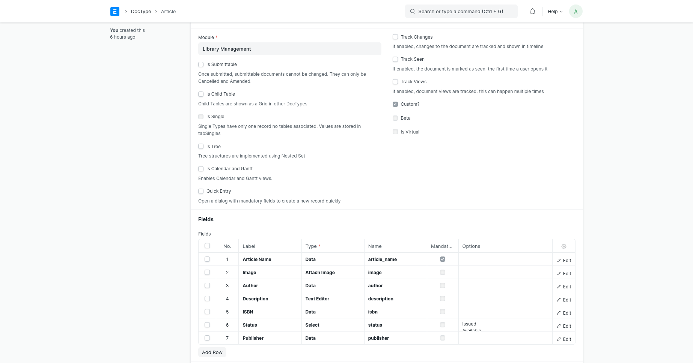
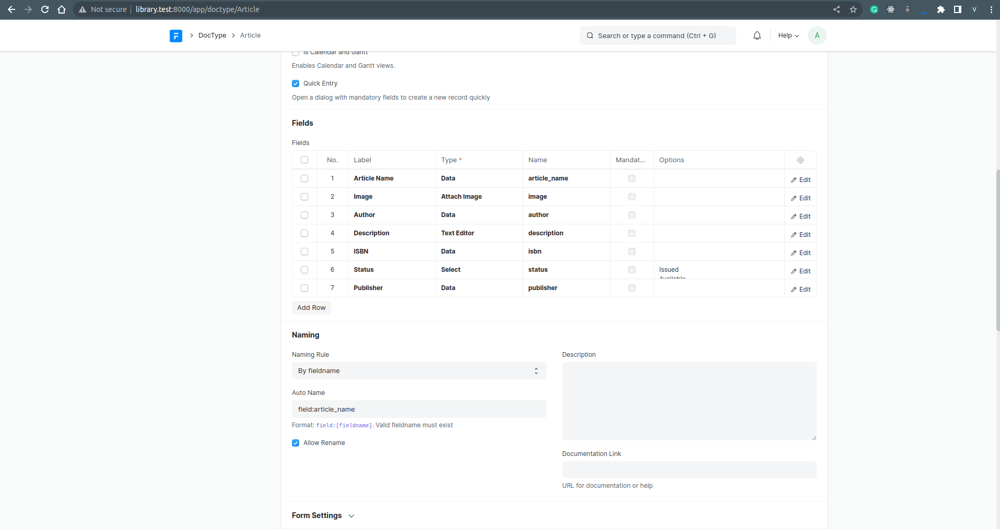
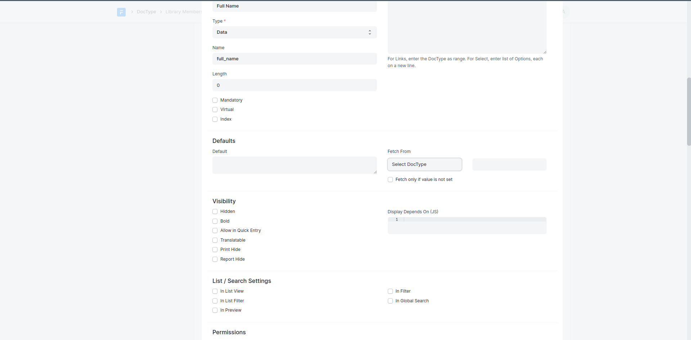
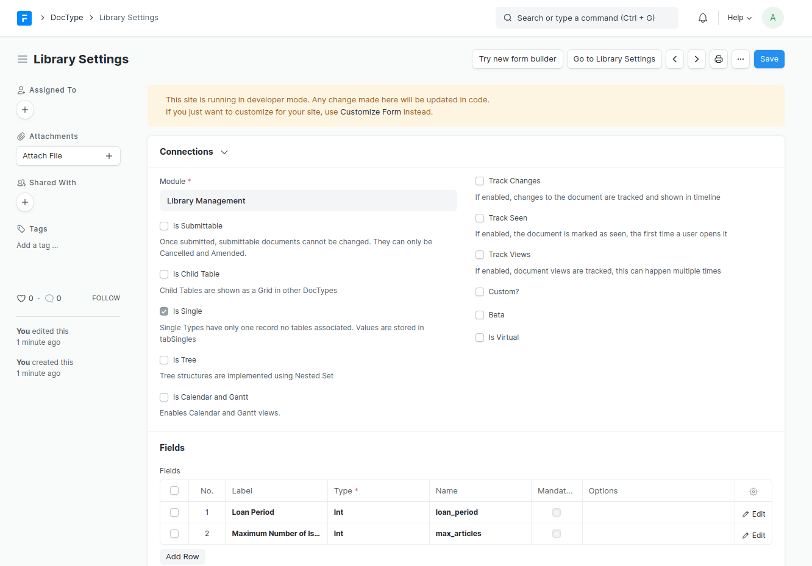
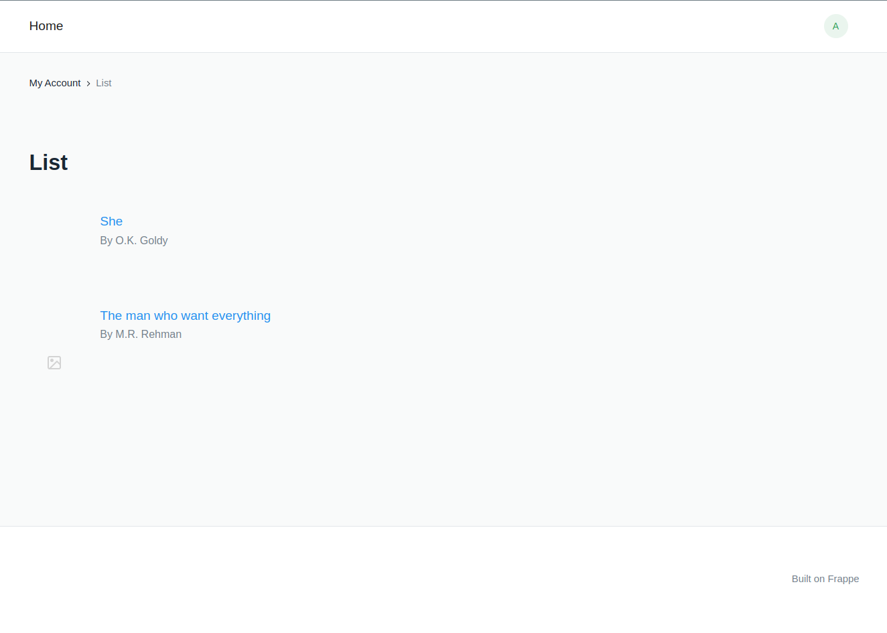

# Library Management with Frappe Framework

## PRE-REQUISTICS

- Python
- MariaDB / Postgres
- HTML / CSS
- JavaScript / jQuery
- Jinja Templating
- Git / GitHub

### Install Frappe and ERPNext

Installing frappe and erpNext using this script
```bash
git clone https://github.com/Karanjot786/install_frappe
cd install_frappe
chmod u+r+x v14script.sh
./v14script.sh
```

## Start bench server

Now that we have created our frappe-bench directory, we can start the Frappe web server by running the following command:

```bash
cd frappe_v14
bench start
```

This will start several processes including a Python web server based on Gunicorn, redis servers for caching, job queuing and socketio pub-sub, background workers, node server for socketio and a node server for compiling JS/CSS files.

The web server will start listening on the port 8000 but we don't have any sites yet to serve. Our next step is to create our app and create a site that will have this app installed.

Make sure not to close the terminal where bench start is running. To run bench commands, create another terminal and cd into the frappe-bench directory.

Good job on following the tutorial so far!

## Create app

To create our Library Management app, run the following command from the frappe-bench directory:

```bash
bench new-app library_management
```

## App directory structure

- library_management: This directory will contain all the source code for your app
  - public: Store static files that will be served from Nginx in production
  - templates: Jinja templates used to render web views
  - www: Web pages that are served based on their directory path
  - library_management: Default Module bootstrapped with app
  - modules.txt: List of modules defined in the app
  - patches.txt: Patch entries for database migrations
  - hooks.py: Hooks used to extend or intercept standard functionality provided by the framework
- requirements.txt: List of Python packages that will be installed when you install this app

## Create a new site

To create a new site, run the following command from the frappe-bench directory:

```bash
bench new-site libaray.co
```

This command will create a new database, so you need to enter your MySQL root password. It will also ask to set the password for the Administrator user, just set a password that you won't forget. This will be useful later.

Now, you will have a new folder named libaray.co in the sites directory.

## Site Directory Structure

As you can see, the `private` folder will contain any database backups and private files. Private files are user uploaded files that need authentication to be accessible.

The `public` folder will contain files that are accessible without authentication. This can contain website images that should be accessible without login.

The `site_config.json` file contains configuration that is specific to this site which should not be version controlled. This is similar to an environment variables file. If you look at the contents of the file, it contains the database configuration values for this site.

## Access Sites in you browser

Frappe will identify which site to serve by matching the hostname of the request with the site name, so you should be able to access your site on ` http://libaray.co:8000 ` but this won't work because we have to tell our operating system that libaray.co should point to localhost. To do that, you can add the following entry to your /etc/hosts file.

```bash
127.0.0.1 libaray.co
```

This will map libaray.co to localhost. Bench has a convenient command to do just that.

```bash
bench --site libaray.co add-to-hosts
```

This will ask for your root password and will add an entry to your /etc/hosts file.

Great, now you can access your site at ` http://libaray.co:8000 `. Congratulations for making it this far.

## Install App on Site

To install our Library Management app on our site, run the following command:

```bash
$ bench --site libaray.co install-app library_management

Installing library_management...
Updating Dashboard for library_management
```

You should see `frappe` and `library_management` as installed apps on your site.

When you create a new site, the `frappe` app is installed by default.

## Login into desk

To create DocTypes in our app, we must log in to Desk. Go to ` http://libaray.co:8000 ` and it should show you a login page.


Enter Administrator as the user and password that you set while creating the site.

After successful login, you will see the setup wizard. This is a one-time setup wizard used to set up the site. Go ahead, select your country and complete the wizard.

You should see the Desk that looks something like this:


Good job making it this far!


---

## Create a DocType

DocType is analogous to a Model in other frameworks. Apart from defining properties, it also defines the behavior of the Model.

Before we can create DocTypes, we need to enable developer mode. This will enable boilerplate creation when we create doctypes and we can track them into version control with our app.

Go to your terminal and from the frappe-bench directory, run the following command:

```bash
bench --site libaray.co set-config --global developer_mode 1
```

## Creating a DocType

While in Desk, type 'doctype' in the search bar and select the **DocType List** option. You will be navigated to the DocType list where you will see a bunch of DocTypes. These are the DocTypes that are bundled with the framework.

The first doctype we will create is **Article**. To create it, click on New.

- Enter Name as Article
- Select Library Management in Module
- Add the following fields in the Fields table:
  - Article Name (Data)
  - Image (Attach Image)
  - Author (Data)
  - Description (Text Editor)
  - ISBN (Data)
  - Status (Select) - Enter two options: Issued and Available (Type Issued, hit enter, then type Available)
  - Publisher (Data)

  After adding the fields, click on Save.

  

You will see a Go to Article List button at the top right of the form. Click on it to go to the Article List. Here you will see a blank list with no records because the table has no records.

Let's create some records. But before that, we need to clear the Desk cache. Click on the Settings dropdown on the right side of the navbar and click on Reload.

Now, you should see the New button. Click on it and you will see the Form view of the Article doctype. Fill in the form and click on Save. You have created your first Article document. Go back to the list view and you should see one record.

## What happened when you created the Article DocType?

- ### Database Table

A database table with the name `tabArticle` was created with the fields we specified in the fields table. You can confirm this by checking it from the MariaDB console

```bash
bench --site libaray.co mariadb

WARNING: Forcing protocol to  TCP  due to option specification. Please explicitly state intended protocol.
Welcome to the MariaDB monitor.  Commands end with ; or \g.
Your MariaDB connection id is 433
Server version: 10.6.12-MariaDB-0ubuntu0.22.04.1 Ubuntu 22.04

Copyright (c) 2000, 2018, Oracle, MariaDB Corporation Ab and others.

Type 'help;' or '\h' for help. Type '\c' to clear the current input statement.

MariaDB [_9321a152cb497eb3]> select * from tabArticle;
+------------+----------------------------+----------------------------+---------------+---------------+-----------+-----+-----------------------------+-------+-------------+------------------------------------>
| name       | creation                   | modified                   | modified_by   | owner         | docstatus | idx | article_name                | image | author      | description                        >
+------------+----------------------------+----------------------------+---------------+---------------+-----------+-----+-----------------------------+-------+-------------+------------------------------------>
| b0af436bcd | 2023-02-27 21:43:15.882797 | 2023-02-27 21:43:15.882797 | Administrator | Administrator |         0 |   0 | The Girl with all the gifts | NULL  | M.R. Marley | <div class="ql-editor read-mode"><p>
+------------+----------------------------+----------------------------+---------------+---------------+-----------+-----+-----------------------------+-------+-------------+------------------------------------>
1 row in set (0.001 sec)

MariaDB [_9321a152cb497eb3]> desc tabArticle;
+--------------+--------------+------+-----+---------+-------+
| Field        | Type         | Null | Key | Default | Extra |
+--------------+--------------+------+-----+---------+-------+
| name         | varchar(140) | NO   | PRI | NULL    |       |
| creation     | datetime(6)  | YES  |     | NULL    |       |
| modified     | datetime(6)  | YES  | MUL | NULL    |       |
| modified_by  | varchar(140) | YES  |     | NULL    |       |
| owner        | varchar(140) | YES  |     | NULL    |       |
| docstatus    | int(1)       | NO   |     | 0       |       |
| idx          | int(8)       | NO   |     | 0       |       |
| article_name | varchar(140) | YES  |     | NULL    |       |
| image        | text         | YES  |     | NULL    |       |
| author       | varchar(140) | YES  |     | NULL    |       |
| description  | longtext     | YES  |     | NULL    |       |
| isbn         | varchar(140) | YES  |     | NULL    |       |
| status       | varchar(140) | YES  |     | NULL    |       |
| publisher    | varchar(140) | YES  |     | NULL    |       |
| _user_tags   | text         | YES  |     | NULL    |       |
| _comments    | text         | YES  |     | NULL    |       |
| _assign      | text         | YES  |     | NULL    |       |
| _liked_by    | text         | YES  |     | NULL    |       |
+--------------+--------------+------+-----+---------+-------+
18 rows in set (0.001 sec)

MariaDB [_9321a152cb497eb3]>
```

The fields we specified in Title Case were converted to snake case automatically, and are used as the column names in the table. For e.g., `article_name`, `image`, `author` , and `description`.

However, many other fields were created like `name`, `creation`, `modified`, `modified_by` . These are standard fields created for all doctypes. `name` is the primary key column.

If you created a record with the Form, you can also run a standard select query to get the rows.

- ### Desk View

There are a number of views that were also created for our DocType. The Article List is the list view that shows the records from the database table. The Form view is the view that is shown when you want to create a new document or view an existing one.

- ### Form Layout

If you notice, the layout of fields in the form is according to how you ordered them in the Fields table. For e.g., Article Name is the first field followed by Image which is followed by Author. In later parts of the tutorial we will learn how to customize this further.


---

## Doctype Features

Previously we created the Article doctype. Let's see what other features we can customize.

## Naming

If you created a document with the Form, you might have noticed that the `name` value of the document was a randomly generated hash. Let's make a change so that the Article Name we provide becomes the `name` of the document.

To do that, open the doctype list from the search bar and click on Article. Now, scroll down to the Naming section and in the Auto Name field enter **field:article_name**. Click on Save.

Now, go back to the Article List and create a new article again.



Now, the name of the document will be the Article Name and it must be unique across Articles. So you cannot create another article with the same name.

You can also check the database records by running a select query in the mariadb console.

```bash
MariaDB [_9321a152cb497eb3]> select * from tabArticle;
+-----------------------------+----------------------------+----------------------------+---------------+---------------+-----------+-----+-----------------------------+-------+-------------+------------------->
| name                        | creation                   | modified                   | modified_by   | owner         | docstatus | idx | article_name                | image | author      | description       >
+-----------------------------+----------------------------+----------------------------+---------------+---------------+-----------+-----+-----------------------------+-------+-------------+------------------->
| b0af436bcd                  | 2023-02-27 21:43:15.882797 | 2023-02-27 21:43:15.882797 | Administrator | Administrator |         0 |   0 | The Girl with all the gifts | NULL  | M.R. Marley | <div class="ql-edi>
| The man who want perfection | 2023-02-27 22:14:40.351230 | 2023-02-27 22:14:40.351230 | Administrator | Administrator |         0 |   0 | The man who want perfection | NULL  | M.R. Goldy  | <div class="ql-edi>
+-----------------------------+----------------------------+----------------------------+---------------+---------------+-----------+-----+-----------------------------+-------+-------------+------------------->
(END)
```

## Form Layout

Let's customize the layout of how the fields are laid out in the form while making good use of the available space. Go to the Article doctype, scroll to the Fields section, and add two new fields of type Column Break and Section Break. We will also hide the Image field as it is not needed to be shown in the form. Check out the GIF to see it in action.


## Form Settings

Go to the Article doctype and scroll down to the Form Settings section. Enter image in the Image Field. This will show the image at the left top of the form. You can also enable Allow Rename to allow renaming of documents.


## Permissions

You can also configure what roles you want to allow and which actions you want to restrict for a DocType. Go to the Article doctype, scroll down to the Permission Rules section, and add the roles.

You can also configure the type of action that is allowed for a particular role. Let's add a Librarian role that has permission for all actions and a Library Member role that has permission for Read action.


You can test this by creating a new User that has the Librarian role, and another User that has the Library Member role. Login with each user, and see what actions are allowed.

---

## Controller Methods

Controller methods allow you to write business logic during the lifecycle of a document.

Let's create our second doctype: Library Member. It will have the following fields:

` DocType List ` > ` Add DocType `

- First Name (Data, Mandatory)
- Last Name (Data)
- Full Name (Data, Read Only)
- Email Address (Data)
- Phone (Data)


After you have created the doctype, go to Library Member list, clear the cache from Settings > Reload and create a new Library Member.

If you notice, the Full Name field is not shown in the form. This is because we set it as Read Only. It will be shown only when it has some value.

Let's write code in our python controller class such that Full Name is computed automatically from First Name and Last Name.

Open your code editor and open the file library_member.py and make the following changes:

```python
class LibraryMember(Document):
    # this method will run every time a document is saved
    def before_save(self):
        self.full_name = f'{self.first_name} {self.last_name or ""}'
```

We wrote the logic in the `before_save` method which runs every time a document is saved. This is one of the many hooks provided by the `Document` class. You can learn more about all the available hooks at [Controller](https://frappeframework.com/docs/v14/user/en/basics/doctypes/controllers) docs.

Now, go back and create another Library Member and see the Full Name show up after save.

---

## Types of DocType

### Library Membership

Let's learn about the different types of doctype in the framework by creating more doctypes.

Let's create another doctype: **Library Membership**. It will have the following fields:

- Library Member (Link, Mandatory)
- Full Name (Data, Read Only)
- From Date (Date)
- To Date (Date)
- Paid (Check)

It will have Is Submittable enabled. It will have Naming set as LMS.##### and restricted to Librarian role. Also, the Title Field should be set to full_name in the View Settings section.

The Link field Library Member is similar to a Foreign Key column in other frameworks. It will let you link the value to a record in another DocType. In this case, it links to a record of Library Member DocType.

```text
!! DON'T FORGET TO SAVE THE doctype before setting up the following
```

The Full Name field is a Read Only field that will be automatically fetched from from the full_name field in the linked record Library Member.



Now, go to the Library Membership list and create a new document. You will see that the Library Member field is a dropdown with existing records shown as options. Select a Library Member and the Full Name will be fetched automatically. Pretty cool, right?

### Linked DocTypes

Linked DocTypes are DocTypes that are linked in other doctypes as Link fields. All doctypes are linkable. We can classify doctypes broadly into Master and Transactional based on the type of data they store. Article, Library Member are examples of Master data because they represent an entity (physical or virtual). Library Membership is an example of doctype which stores transactional data.

### Submittable DocTypes

When you enable Is Submittable in a DocType is becomes a Submittable DocType. A Submittable doctype can have 3 states: Draft, Submitted and Cancelled. A document in the Draft state can be changed like any document, however once it is in Submitted state, the value of any field in the document cannot be changed. A Submitted document can be Cancelled, which makes the document invalid. If you notice, an extra field was added in our Library Membership doctype called Amended From. This field is used to keep track of amendments in documents. Once a document is Cancelled, it can only be amended, which means it can be duplicated and the cancelled document will be linked to the new amended document via the Amended From field.

## Controller Validation for Membership

Now, let's write code that will make sure whenever a Library Membership is created, there is no active membership for the Member.

**library_membership.py**

```python
# Copyright (c) 2023, vipin and contributors
# For license information, please see license.txt

import frappe
from frappe.model.document import Document


class LibraryMembership(Document):
	# check before submitting this document
    def before_submit(self):
        exists = frappe.db.exists(
            'Library Membership',
            {
                'library_member': self.library_member,
                # check for submitted documents
                'docstatus': 1,
                # check if the membership's end date is later than this membership's start date
                'to_date': ('>', self.from_date),
            },
        )
        if exists:
            frappe.throw('There is an active membership for this member')
```

We wrote our logic in the before_submit method which will run before we submit the document. We used the frappe.db.exists method to check if a Library Membership record exists with our provided filters. If it exists, we used frappe.throw to stop the execution of program with a message that will show up letting the user know the reason.

Now, try creating a Library Membership with an overlapping period and you should see an error when you submit the document.


## Library Transaction

Let's create a DocType to record an Issue or Return of an Article by a Library Member who has an active membership.

This doctype will be called **Library Transaction** and will have the following fields:

- Article - Link to Article
- Library Member - Link to Library Member
- Type - Select with 2 options: Issue and Return
- Date - Date of Transaction

This doctype will also be a Submittable doctype.


## Validation for Transaction

When an Article is issued, we should verify whether the Library Member has an active membership. We should also check whether the Article is available for Issue. Let's write the code for these validations.

**library_transaction.py**

```python
# Copyright (c) 2023, vipin and contributors
# For license information, please see license.txt

import frappe
from frappe.model.document import Document

class LibraryTransaction(Document):
    def before_submit(self):
        if self.type == 'Issue':
            self.validate_issue()
            # set the article status to be Issued
            article = frappe.get_doc('Article', self.article)
            article.status = 'Issued'
            article.save()

        elif self.type == 'Return':
            self.validate_return()
            # set the article status to be Available
            article = frappe.get_doc('Article', self.article)
            article.status = 'Available'
            article.save()

    def validate_issue(self):
        self.validate_membership()
        article = frappe.get_doc('Article', self.article)
        # article cannot be issued if it is already issued
        if article.status == 'Issued':
            frappe.throw('Article is already issued by another member')

    def validate_return(self):
        article = frappe.get_doc('Article', self.article)
        # article cannot be returned if it is not issued first
        if article.status == 'Available':
            frappe.throw('Article cannot be returned without being issued first')

    def validate_membership(self):
        # check if a valid membership exist for this library member
        valid_membership = frappe.db.exists(
            'Library Membership',
            {
                'library_member': self.library_member,
                'docstatus': 1,
                'from_date': ('<', self.date),
                'to_date': ('>', self.date),
            },
        )
        if not valid_membership:
            frappe.throw('The member does not have a valid membership')
```

There is a lot of code here but it should be self explanatory. There are inline code comments for more explanation.

## Library Settings

Let's create the last doctype for our app: Library Settings. It will have the following fields:

- Loan Period - Will define the loan period in number of days
- Maximum Number of Issued Articles - Restrict the maximum number of articles that can be issued by a single member

Since we don't need to have multiple records for these settings, we will enable Is Single for this doctype.



After creating the doctype, click on Go to Library Settings, to go to the form and set the values for Loan Period and Maximum Number of Issued Articles.

## Single DocTypes

When a DocType has Is Single enabled, it will become a Single DocType. A single doctype is similar to singleton records in other frameworks. It does not create a new database table. Instead all single values are stored in a single table called tabSingles. It is used usually for storing global settings.

## Validation for Library Settings

Let's make the change in Library Membership such that, the To Date automatically computed based on the Loan Period and the From Date.

**library_membership.py**

```python
# Copyright (c) 2023, vipin and contributors
# For license information, please see license.txt

import frappe
from frappe.model.document import Document


class LibraryMembership(Document):
	# check before submitting this document
    def before_submit(self):
        exists = frappe.db.exists(
            'Library Membership',
            {
                'library_member': self.library_member,
                # check for submitted documents
                'docstatus': 1,
                # check if the membership's end date is later than this membership's start date
                'to_date': ('>', self.from_date),
            },
        )
        if exists:
            frappe.throw('There is an active membership for this member')

        # get loan period and compute to_date by adding loan_period to from_date
        loan_period = frappe.db.get_single_value('Library Settings', 'loan_period')
        self.to_date = frappe.utils.add_days(self.from_date, loan_period or 30)
```

We have used `frappe.db.get_single_value` method to get the value of `loan_period` from the Library Settings doctype.

Now, let's make the change in Library Transaction such that when an Article is Issued, it checks whether the maximum limit is reached.

**library_transaction.py**

```python
# Copyright (c) 2023, vipin and contributors
# For license information, please see license.txt

import frappe
from frappe.model.document import Document

class LibraryTransaction(Document):
    def before_submit(self):
        if self.type == 'Issue':
            self.validate_issue()
            # set the article status to be Issued
            article = frappe.get_doc('Article', self.article)
            article.status = 'Issued'
            article.save()

        elif self.type == 'Return':
            self.validate_return()
            # set the article status to be Available
            article = frappe.get_doc('Article', self.article)
            article.status = 'Available'
            article.save()

    def validate_issue(self):
        self.validate_membership()
        article = frappe.get_doc('Article', self.article)
        # article cannot be issued if it is already issued
        if article.status == 'Issued':
            frappe.throw('Article is already issued by another member')

    def validate_return(self):
        article = frappe.get_doc('Article', self.article)
        # article cannot be returned if it is not issued first
        if article.status == 'Available':
            frappe.throw('Article cannot be returned without being issued first')


    def validate_maximum_limit(self):
        max_articles = frappe.db.get_single_value('Library Settings', 'max_articles')
        count = frappe.db.count(
            'Library Transaction',
            {'library_member': self.library_member, 'type': 'Issue', 'docstatus': 1},
        )
        if count >= max_articles:
            frappe.throw('Maximum limit reached for issuing articles')


    def validate_membership(self):
        # check if a valid membership exist for this library member
        valid_membership = frappe.db.exists(
            'Library Membership',
            {
                'library_member': self.library_member,
                'docstatus': 1,
                'from_date': ('<', self.date),
                'to_date': ('>', self.date),
            },
        )
        if not valid_membership:
            frappe.throw('The member does not have a valid membership')
```

We added a validate_maximum_limit method and used frappe.db.count to count the number of transactions made by the member.

With that, we have covered the basics of doctype creation and types of doctype. We also wrote business logic for various doctypes.

Good job making it this far. Let's keep going.

---

## Form Scripts

Form Scripts are client-side javascript code that enhances the UX of your Forms.

Let's say you want to create a membership for a member. To do this, you have to go to the Library Membership list, create a new form, select the member and other fields and then save.

Similarly, when you want to create a transaction against a member, you have to make a new Library Transaction form.

We can make this process easier. Write the following code in **library_member.js**

```javascript
frappe.ui.form.on('Library Member', {
    refresh: function(frm) {
        frm.add_custom_button('Create Membership', () => {
            frappe.new_doc('Library Membership', {
                library_member: frm.doc.name
            })
        })
        frm.add_custom_button('Create Transaction', () => {
            frappe.new_doc('Library Transaction', {
                library_member: frm.doc.name
            })
        })
    }
});
```

Now, refresh your page and go to the Library Member form. You should see two buttons on the top right. Click on them to try them out. They will automatically set the Library Member in each of those documents making the process easier.


We have only scratched the surface here. You can do a lot more with Form Scripts. Learn more about the API at [Form Scripts API](https://frappeframework.com/docs/v14/user/en/api/form).

---

## Portal Pages

Portal pages are server rendered pages for your website visitors.

We have been exclusively working with the Desk which is the admin interface accessible by System Users. Usually you will want to give limited access to your customers. In our case, we want Library Members to be able to view available Articles that they can issue from our website. Portal Pages can help us achieve that.

Go to Article doctype, and scroll down to the Web View section.

- Enable Has Web View and Allow Guest to View
- Enter articles in the Route field
- Add a field named Route in the fields table
- Click on Save


We have now enabled web views for Article doctype. This means you can now view details of an Article on your website without logging into Desk. Let's test this out by creating a new Article. You should see See on Website at the top left of your form. Click on it to view the web view of the Article.


## Customize Web View Template

The default web view that is generated is pretty barebones and serves only as a starting point for us to customize it. When we made Article a web view, two HTML files were created namely: `article.html` and article_row.html

Let's edit `article.html` first. Frappe uses Bootstrap 4 by default for it's web views. So, you can use any valid Bootstrap 4 markup to style your pages. Add the following HTML to `article.html`.


```Django HTML



<div class='py-20 row'>
    <div class='col-sm-2'>
        
    </div>
    <div class='col'>
        <h1>{{ title }}</h1>
        <p class='lead'>By {{ author }}</p>
        <div>
            
            <span class='badge badge-success'>Available</span>
            
            <span class='badge badge-primary'>Issued</span>
            
        </div>
        <div class='mt-4'>
            <div>Publisher: <strong>{{ publisher }}</strong></div>
            <div>ISBN: <strong>{{ isbn }}</strong></div>
        </div>
        <p>{{ description }}</p>
    </div>
</div>

```

Now, go to any Article and click on See on Website. If you have filled in all fields of your Article, you should see a page like this:


Now, open http://libaray.co:8000/articles. This should show the list of articles, but it is also pretty barebones. Let's customize the HTML.

Edit the article_row.html and add the following HTML:


```HTML
<div class='py-8 row'>
    <div class='col-sm-1'>
        
    </div>
    <div class='col'>
        <a class='font-size-lg' href='{{ doc.route }}'>{{ doc.name }}</a>
        <p class='text-muted'>By {{ doc.author }}</p>
    </div>
</div>
```

Now, the articles list should look prettier. You can click on any article to view it's details.


